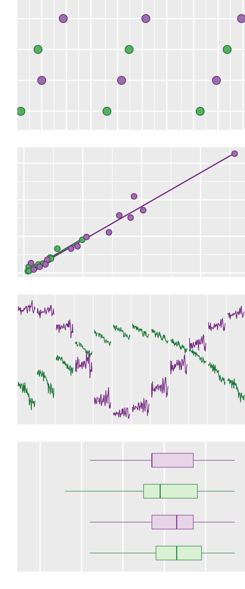
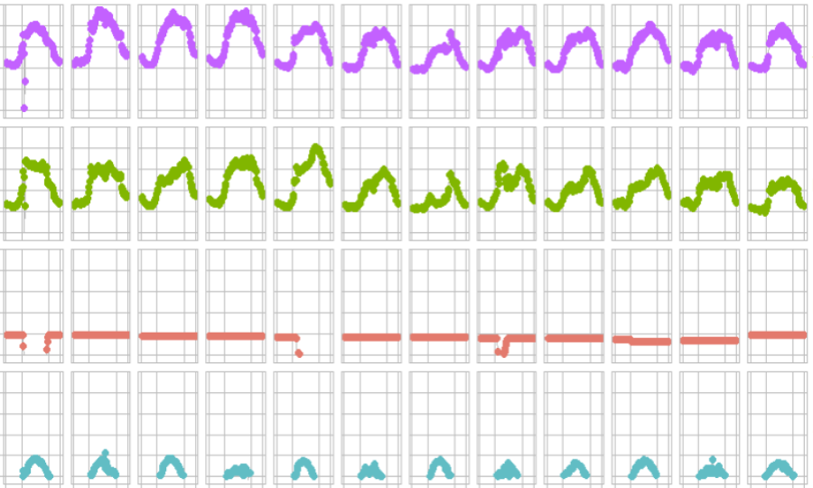
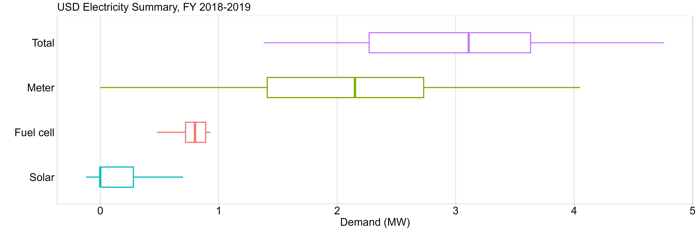

```{r setup, include=FALSE}
options(htmltools.dir.version = FALSE)
knitr::opts_chunk$set(echo=FALSE, 
                      warning=FALSE, 
                      message=FALSE, 
                      comment=NULL, 
                      fig.align = "center")
knitr::opts_knit$set(root.dir = "../")

library("data.table")
library("ggplot2")
library("knitr")
library("kableExtra")
library("graphclassmate")
library("wrapr")
library("gapminder")
library("ggpubfigs") # color vision deficient inclusive palettes 

options(
  datatable.print.nrows = 16,
  datatable.print.topn = 6,
  datatable.print.class = TRUE
)

my_table <- function(x){
 x |>
  # kbl(col.names = NULL) |>
  kbl() |>
  kable_styling(position = "center", font_size = 20) |>
  # add_header_above(c("Variables" = ncol(x))) |>
  kable_paper(lightable_options = "basic", full_width = FALSE) |>
  row_spec(0, background = "#c7eae5") |>
  column_spec(1:dim(x)[2], 
              color = "black", 
              background = "white", 
              width = "1.75in")
  
  
  
}
uniform_point <- geom_point(size = 6, 
                            shape = 21, 
                            color = "black", 
                            fill = rcb("dark_Gray"))

uniform_point_2 <- geom_point(size = 3, 
                              shape = 21, 
                              alpha = 0.75, 
                              color = "black", 
                              fill = rcb("dark_Gray"))

uniform_color <- scale_color_manual(values = "black")
uniform_fill  <- scale_fill_manual(values = rcb("dark_Gray")) 

uniform_jitter <- geom_jitter(size = 6, 
                              shape = 21, 
                              alpha = 0.75, 
                              width = 0, 
                              height = 0.2)

superpose_point <- geom_point(size = 6, shape = 21)

superpose_color <- scale_color_manual(values = c(rcb("dark_Gn"),                                                              rcb("dark_PR")))
superpose_fill_mid <- scale_fill_manual(values = c(rcb("mid_Gn"), 
                                               rcb("mid_PR"))) 
superpose_fill_pale <- scale_fill_manual(values = c(rcb("pale_Gn"), 
                                               rcb("pale_PR"))) 
```

class: right

```{r}
library(magick)
a <- image_read("slides/img/dot-superpose-preview-v2.png")
b <- image_read("slides/img/scatterplot-preview.png")
c <- image_read("slides/img/new-preview.png")
d <- image_read("slides/img/boxplot-preview.png")

z <- image_append(c(c, d), stack = TRUE)
z <- image_append(c(z, a), stack = TRUE)
z <- image_append(c(z, b), stack = TRUE)
image_write(z, 
        path = "slides/img/test-composite.png", 
        format = "png")
```


.left-column[

]

# Expanding your graphical repertoire

###  Variables, design, message

<br>

<br>

2026--02--10

Richard Layton   

<br>

<br>

<https://graphdr.github.io/data-stories/>

<https://github.com/graphdr>

<a href="mailto:graphdoctor@gmail.com">graphdoctor@gmail.com</a>


---
class: left

.left-column[

]

#### $\quad$ 

#### $\quad$ Showing evolution

#### $\quad$

<br>

#### $\quad$ Displaying distributions

#### $\quad$

<br>

#### $\quad$ Comparing data

#### $\quad$

<br>

#### $\quad$ Revealing correlations


<div class="my-footer">
<span>
Optimal design categories from: Jean-luc Doumont (2009) <em>Trees, Maps and Theorems</em>, Principiae, p. 133.
</span>
</div> 


---
class:inverse, center, middle

# Showing evolution


---
class: left

# Evolution: display how a quantity evolves over time

.pull-left[

]
.pull-right[
<br>
- Data are time-dependent

- Try different ways of organizing the data: by minute, hour, day, week, etc. 


]


---
class:inverse, center, middle

# Displaying distributions


---
class: left

# Data

World speed skiing competitions, 1953&ndash;1995

.pull-left[
```{r}
#| comment: NULL
#| echo: false
options(
  datatable.print.nrows = 16,
  datatable.print.topn = 10
)
# full distribution, jittered
library("GDAdata")

x <- data.table(SpeedSki)
x <- x[, .(Year, Speed, Sex, Event)]
setcolorder(x, c("Event", "Year", "Sex"))
setkeyv(x, c("Event", "Year", "Sex"))
x[]
```
]
.pull-right[

<br>

```{r}
#| echo: false

x <- wrapr::build_frame(
  "variable", "type" |
    "event", "categorical" |
    "year", "categorical" |
    "sex", "categorical" |
    "speed (km/hr)", "quantitative"
)
my_table(x) 
# |>
#   column_spec(1, width = "3in") |>
#   column_spec(2, width = "2in")
```
]

<div class="my-footer">
<span>Data source: 2011 World speed skiing competition, in the
<a href="https://CRAN.R-project.org/package=GDAdata">GDAdata</a> R package</span>
</div> 


---
class: left

# Strip chart

```{r, fig.asp = 0.15, fig.width = 16}
# for using uniform manual color and fill 
SpeedSki$dummy <- "dummy"
set.seed(20181216)
p <- ggplot(SpeedSki, aes(x = Speed, y = 0, color = dummy, fill = dummy)) +
  uniform_jitter +
  uniform_color +
  uniform_fill + 
  scale_y_continuous(limits = 1.5 * c(-1, 1)) +
  theme_graphclass(font_size = 20) +
  labs(x = "Speed (km/hr)", 
       y = "All events (1953–1995)") +
  theme(axis.text.y = element_blank(), 
        axis.title.y = element_text(angle = 0, vjust = 0.5), 
        panel.grid.major.y = element_blank(), 
        panel.grid.minor.y = element_blank(), 
        legend.position = "none")

p

ggsave(
  filename = "results/day-2-distributions-01.png", 
  width = 15,
  height = 2.5,
  units = c("in"),
  dpi = 300
)
```

<br>

```{r echo=FALSE}
x <- build_frame(
   "variable" , "type" |
   "speed"    , "quantitative")
my_table(x)
```


---
class: left

# Add a category

```{r, fig.asp = 0.2, fig.width = 16}
# full distribution, jittered
set.seed(20181216)


x <- data.table(SpeedSki)
x <- x[, .(Year, Event, Speed, Sex, dummy)]
y <- x[, .(Year, Event)]
y[, `:=` (start = min(Year), end = max(Year)), by = c("Event")]
y[, Event_yr := paste0(Event, " (", start, "-", end,  ")" )]
y <- y[, .(Event, Event_yr)]
y <- unique(y)
x <- y[x, on = c("Event")]


SpeedSki <- copy(x)

p <-ggplot(SpeedSki, aes(x = Speed, 
                     y = reorder(Event_yr, Speed, median), 
                     color = dummy,
                     fill = dummy
                     )) +
  uniform_jitter +
  uniform_color +
  uniform_fill + 
  theme_graphclass(font_size = 20) +
  labs(x = "Speed (km/hr)", 
       y = "") +
  theme(panel.grid.minor.y = element_blank(), 
        legend.position = "none")

p

ggsave(
  filename = "results/day-2-distributions-02.png", 
  width = 15,
  height = 3,
  units = c("in"),
  dpi = 300
)
```


```{r echo=FALSE}
x <- build_frame(
   "variable", "type" |
  "event", "categorical"|
   "speed", "quantitative" 

   )
my_table(x)
```


---
class: left

# Add a second category

```{r, fig.asp = 0.2, fig.width = 16}
# full distribution, jittered
set.seed(20181216)
p <- ggplot(SpeedSki, aes(x = Speed, 
                     y = reorder(Event_yr, Speed, median), 
                     color = Sex, 
                     fill = Sex)) +
  uniform_jitter +
  superpose_color + 
  superpose_fill_mid +
  theme_graphclass(font_size = 20) +
  labs(x = "Speed (km/hr)", 
       y = "") +
  theme(panel.grid.minor.y = element_blank(), 
        legend.position = "none") +
  geom_text(aes(x = 200, 
                y = 2.6, 
                label = "women"), 
            color = rcb("dark_Gn"), 
            size = 7) +
  geom_text(aes(x = 210, 
                y = 2.6, 
                label = "men"), 
            color = rcb("dark_PR"), 
            size = 7)
p

ggsave(
  filename = "results/day-2-distributions-03.png", 
  width = 15,
  height = 3,
  units = c("in"),
  dpi = 300
)
```


```{r echo=FALSE}
x <- build_frame(
   "variable"   , "type" |
   "event"      , "categorical", 
   "sex"        , "categorical"|
      "speed"      , "quantitative" )
my_table(x)
```


---
class: left

# Data

MIDFIELD graduates (N = 270k), enrolled in Engineering, excluding 10th and 90th quantiles

.pull-left[
```{r}
#| comment: NULL
options(datatable.print.topn = 10)

dt <- readRDS("data/boxplot-merge-category.rds")
dt[, sex := ifelse(sex_path %ilike% "female", "Female", "Male")]
dt <- dt[, .(path, sex, enrolled)]
setnames(dt, old = c("enrolled"), new = c("years_to_grad"))
setkeyv(dt, c("path", "sex"))
dt[]
```
]
.pull-right[

<br>

```{r echo=FALSE}
x <- wrapr::build_frame(
  "variable", "type" |
    "path", "categorical" |
    "sex", "categorical" |
    "years to graduate", "quantitative"
)
my_table(x) |>
  column_spec(1, width = "3in") |>
  column_spec(2, width = "2in")
```
]

<div class="my-footer">
<span>Data source: MIDFIELD subset from the 
<a href="https://github.com/graphdr/graphclassmate">graphclassmate</a> R package</span>
</div> 


---
class: left

# Box and whisker chart

<br>

```{r, fig.asp = 0.15, fig.width = 16}
p <- ggplot(dt, aes(x = years_to_grad)) +
  geom_boxplot(size = 1, 
               width = 0.5, 
               color = "black", 
               fill = rcb("pale_Gray")) +
  labs(x = "Time to graduate (yr)", 
       y = "", 
       title = "Graduates of 4-year US universities (N = 269,057)") +
  theme_graphclass(font_size = 20) +
  theme(axis.text.y        = element_blank(), 
        panel.grid.major.y = element_blank(), 
        panel.grid.minor.y = element_blank(), 
        axis.ticks.y       = element_blank()) +
  scale_y_continuous(limits = c(-1, 1))

p

ggsave(
  filename = "results/day-2-distributions-04.png", 
  width = 15,
  height = 2.4,
  units = c("in"),
  dpi = 300
)
```

<br>


```{r echo=FALSE}
x <- build_frame(
   "variable"   , "type" |
   "years to graduate"      , "quantitative")
my_table(x)
```


---
class: left

# Add a category

<br>

```{r, fig.asp = 0.16, fig.width = 16}
dt <- readRDS("data/boxplot-compare.rds")
# dt <- dt[, path := paste(path, "students")]
p <- ggplot(dt, aes(x = enrolled, y = reorder(path, -enrolled, median))) +
  geom_boxplot(size = 1, 
               width = 0.45, 
               outlier.shape = NA, 
               color = "black", 
               fill = rcb("pale_Gray")) +
  labs(x = "Time to graduate (yr)", 
       y = "", 
       title = "Graduates of 4-year US universities (N = 269,057)") +
  theme_graphclass(font_size = 20) +
  theme(panel.grid.major.y = element_blank(), 
        panel.grid.minor.y  = element_blank(), 
        axis.ticks.y       = element_blank())
p

ggsave(
  filename = "results/day-2-distributions-05.png", 
  width = 15,
  height = 2.5,
  units = c("in"),
  dpi = 300
)
```

<br>

```{r echo=FALSE}
x <- build_frame(
  "variable" , "type" |
    "path", "categorical" |
    "years to graduate", "quantitative"
)
my_table(x)
```


---
class: left

# Combine a second category

```{r, fig.asp = 0.23, fig.width = 16}
dt <- readRDS("data/boxplot-merge-category.rds")
# dt <- dt[, path := paste(path, "students")]
# dt <- dt[, sex_path := paste(sex_path, "students")]
p <- ggplot(dt, aes(x = enrolled, 
               y = reorder(sex_path, -enrolled, median), 
               fill = path, 
               color = path
               )) +
  geom_boxplot(size = 1, width = 0.45, outlier.shape = NA) +
  superpose_color +
  superpose_fill_pale +
  labs(x = "Time to graduate (yr)", 
       y = "", 
       title = "Graduates of 4-year US universities (N = 269,057)") +
  theme_graphclass(font_size = 20) +
  theme(panel.grid.major.y = element_blank(), 
        panel.grid.minor.y  = element_blank(), 
        axis.ticks.y       = element_blank(), 
        legend.key.height  = unit(15, "mm"))+ 
  guides(fill = guide_legend(title = NULL, reverse = TRUE),
         color = "none")
p

ggsave(
  filename = "results/day-2-distributions-06.png", 
  width = 15,
  height = 3.5,
  units = c("in"),
  dpi = 300
)
```

  
<br>

```{r echo=FALSE}
x <- build_frame(
   "variable" , "type" |
   "sex and path", "categorical" |
    "years to graduate", "quantitative" )
my_table(x)
```


```{r}
# -------------------- COVER PAGE -------------------- 
p <- ggplot(dt, aes(x = enrolled, 
               y = reorder(sex_path, -enrolled, median), 
               fill = path, 
               color = path
               )) +
  geom_boxplot(size = 0.2, width = 0.45, outlier.shape = NA) +
  superpose_color +
  superpose_fill_pale +
  labs(x = "", y = "") +
  theme(legend.position = "none", 
        axis.text  = element_blank(), 
        axis.ticks = element_blank(), 
        plot.margin = unit(c(0, 0, 0, 0), "null"),
        panel.spacing = unit(0.02, "lines"),
        # panel.grid.major.x = element_blank(), 
        panel.grid.minor.x = element_blank(), 
        panel.grid.major.y = element_blank(), 
        panel.grid.minor.y = element_blank(), 
        strip.text = element_blank())

ggsave(filename = "slides/img/boxplot-preview.png", 
       width = 3,
       height = 1.8,
       units = "in")
```


---
class: left

# Data

USD monthly peak-demand data, fiscal year 2018--2019

.pull-left[

]
.pull-right[

<br>

If we ignore time-dependence, we're left with: 

```{r echo=FALSE}
x <- wrapr::build_frame(
  "variable", "type" |
  	"power source", "categorical" |
    "demand in MW", "quantitative"
)
my_table(x) |>
  column_spec(1, width = "1.5in") |>
  column_spec(2, width = "1.5in")
```
]


---
class: left

# Ignoring time

Time is not always the most important dependent variable.

<br>




---
class: left

# Discussion

.pull-left[

]
.pull-right[
<br>
Quantitative test scores from a recent exam could be displayed as a **distribution**.

- What categorical variable(s) could be added to create comparative distributions?
]


---
class:inverse, center, middle

# Comparing data


---
class: left

# Data

```{r}
#| include: false
# representation at graduation
# EAEEIC 2022 paper
# 19 universities in the USA for 1987 through 2018. 

d <- wrapr::build_frame(
"origin" , "sex", "Electrical Engr", "Computer Engr","Computer Science" |
"International" , "Female" ,	 1865 ,	 140 ,	 365 |
"International" , "Male"   ,	 8530 ,	 993 ,	1442 |
"Domestic"      , "Female" ,	23426 ,	 702 ,	2923 |
"Domestic"      , "Male"   ,	90150 ,	7481 ,	13987
)
d <- data.table(d)

fwrite(d, "data/session-2-compare-repr-at-grad.csv")
x <- copy(d)


d <- melt(d, id.vars = c("origin", "sex"), variable.name = "program", value.name = "N")
d[, origin_sex := paste(origin, sex)]
by_program <- d[, .(N = sum(N)), by = c("program")]
by_program_origin <- d[, .(N = sum(N)), by = c("program", "origin")]
by_program_sex <- d[, .(N = sum(N)), by = c("program", "sex")]
```

Representation at graduation in 3 engineering programs, 19 US institutions,   1987&ndash;2018

```{r}
setorder(x, origin, sex)
setnames(x, old = c("origin", "sex"), new = c("Origin", "Sex"))
x |>
  kableExtra::kbl(align = "llrrr") |>
  kableExtra::kable_paper(lightable_options = "basic", full_width = TRUE) |>
  kableExtra::row_spec(0, background = "#c7eae5") |>
  kableExtra::row_spec(0:4, font_size = 24) |>
  # kableExtra::column_spec(1, monospace = TRUE) |>
  kableExtra::column_spec(1:5, 
                          color = "black", 
                          background = "white")
```


<div class="my-footer">
<span>Data source: 2022 MIDFIELD  
</span>
</div> 


---
class: left

# Dot chart


```{r echo=FALSE, fig.width=16, fig.height=3.5}
p <- ggplot(by_program, aes(x = N/1000, y = reorder(program, N, median)))  +
  uniform_point + 
  uniform_color +
  uniform_fill +
  theme_graphclass(font_size = 20) +
  labs(x = "Number of graduates (thousands)", 
       y = "", title = "") +
  scale_x_continuous(limits = c(0, 150), breaks = seq(0, 150, 25))
p

ggsave(
  filename = "results/day-2-compare-01.png", 
  width = 16,
  height = 3,
  units = c("in"),
  dpi = 300
)
```

<br>

```{r echo=FALSE}
x <- build_frame(
   "variable" , "type"   |
   "program"  , "categorical" |
   "count of graduates", "quantitative")
my_table(x)
```


---
class: left

# Add a second category 


```{r echo=FALSE, fig.width=16, fig.height=3.5}
dt <- copy(by_program_origin)
p <- ggplot(dt, aes(x = N/1000, y = reorder(program, N, median), color = origin, fill = origin)) +
  superpose_point + 
  superpose_color +
  superpose_fill_mid +
  theme_graphclass(font_size = 20) +
  labs(x = "Number of graduates (thousands)", 
       y = "", title = "") +
  scale_x_continuous(limits = c(0, 150), breaks = seq(0, 150, 25)) +
  theme(legend.position = "none") +
  annotate("text",
           x = c(13, 116),
           y = 3,
           label = c("International", "Domestic"),
           size = 7,
           hjust = 0, vjust = 0.5)
p

ggsave(
  filename = "results/day-2-compare-02.png", 
  width = 16,
  height = 3,
  units = c("in"),
  dpi = 300
)
```


<br>

```{r echo=FALSE}
x <- wrapr::build_frame(
   "variable" , "type"   |
    "program", "categorical" |
    "origin", "categorical" |
    "count of graduates", "quantitative" 
)
my_table(x)
```


---
class: left

# Exchange mapping of categorical variables

```{r echo=FALSE, fig.width=16, fig.height=3.5}
dt <- copy(by_program_origin)
p <- ggplot(dt, aes(x = N/1000, y = reorder(origin, N, median), color = program, fill = program)) +
  superpose_point + 
  # facet_wrap(vars(reorder(program, N, median)), ncol = 3) +
  theme_graphclass(font_size = 20) +
  labs(x = "Number of graduates (thousands)", 
       y = "", title = "") +
  scale_x_continuous(limits = c(0, 150), breaks = seq(0, 150, 25)) + 
  scale_color_manual(values = c(rcb("dark_Gn"), "black", rcb("dark_PR"))) +
  scale_fill_manual(values = c(rcb("mid_Gn"), rcb("mid_Gray"),  rcb("mid_PR"))) +
  theme(legend.position = "none") + 
  geom_text(data = dt[origin == "Domestic"],
            aes(x = N/1000, y = c(2.3, 2.3, 1.7), label = program),
            size = 7, 
            hjust = c(1, 0, 0), 
            vjust = 0.5)
p

ggsave(
  filename = "results/day-2-compare-03.png", 
  width = 16,
  height = 3,
  units = c("in"),
  dpi = 300
)
```


---
class: left

# Logarithmic scale for orders of magnitude differences

```{r echo=FALSE, fig.width=16, fig.height=3.5}
p <- p +
  aes(x = log10(N), 
      y = reorder(origin, N, median), 
      color = program, 
      fill = program) +
  scale_x_continuous(limits = c(2, 6), breaks = seq(1, 6, 1)) +
  labs(x = "Number of graduates (log base 10)", 
       y = "", title = "") + 
  geom_text(data = dt[origin == "Domestic"],
            aes(x = log10(N), y = c(2.3, 2.3, 2.3), label = program),
            size = 7, 
            hjust = c(0, 1, 0), 
            vjust = 0.5)

p

ggsave(
  filename = "results/day-2-compare-04.png", 
  width = 16,
  height = 2.8,
  units = c("in"),
  dpi = 300
)
```


---
class: left

# One program per facet

```{r echo=FALSE, fig.width=16, fig.height=3.5}
dt <- copy(by_program_origin)
p <- ggplot(dt, aes(x = log10(N), y = reorder(origin, N, median))) +
  uniform_point + 
  facet_wrap(vars(reorder(program, N, median)), ncol = 3) +
  theme_graphclass(font_size = 20) +
  scale_x_continuous(limits = c(2, 6), breaks = seq(1, 6, 1)) +
  labs(x = "Number of graduates (log base 10)", 
       y = "") 
p

ggsave(
  filename = "results/day-2-compare-05.png", 
  width = 16,
  height = 2.8,
  units = c("in"),
  dpi = 300
)
```


---
class: left

# Add a third category

```{r echo=FALSE, fig.width=16, fig.height=3.5}
p <- ggplot(d, aes(x = log10(N), y = reorder(origin, N, median), color = sex, fill = sex)) +
  facet_wrap(vars(reorder(program, N, median)), ncol = 3) +
  superpose_point + 
  superpose_color +
  superpose_fill_mid +
  theme_graphclass(font_size = 20) +
  labs(x = "Number of graduates (log base 10)",
       y = "") +
  scale_x_continuous(limits = c(2, 6), breaks = seq(1, 6, 1)) +
  theme(legend.position = "none") + 
  geom_text(data = d[program == "Computer Engr" & origin == "Domestic"],
            aes(x = log10(N), y = c(2.3, 2.3), label = sex),
            size = 7, 
            hjust = 0, 
            vjust = 0.5)
p

ggsave(
  filename = "results/day-2-compare-06.png", 
  width = 16,
  height = 2.8,
  units = c("in"),
  dpi = 300
)
```

<br>

```{r echo=FALSE}
x <- wrapr::build_frame(
   "variable" , "type"   |
    "program", "categorical" |
    "origin", "categorical" |
     "sex", "categorical" |
    "count of graduates", "quantitative" 
)
my_table(x)
```


---
class: left

# Combine categories

```{r echo=FALSE, fig.asp=0.25, fig.width=16}
p <- ggplot(d, aes(x = log(N, base = 10), 
              y = reorder(origin_sex, N, median))) +
  uniform_point + 
  facet_wrap(vars(reorder(program, N, median)), ncol = 3) +
  theme_graphclass(font_size = 20) +
  labs(x = "Number of graduates (log base 10)", 
       y = "") +
  theme(legend.position = "none") + 
  scale_x_continuous(limits = c(2, 6), breaks = seq(1, 6, 1))

p

ggsave(
  filename = "results/day-2-compare-07.png", 
  width = 16,
  height = 3.2,
  units = c("in"),
  dpi = 300
)
```

<br>

```{r echo=FALSE}
x <- wrapr::build_frame(
  "variable", "type" |
    "origin/sex", "categorical" |
    "program", "categorical" |
    "count of graduates", "quantitative" 
)
my_table(x)
```


```{r}
# -------------------- COVER PAGE -------------------- 
p <- ggplot(d, aes(x = log(N, base = 10), 
              y = reorder(origin_sex, N, median), 
              color = sex, fill = sex)) +
  geom_point(shape = 21, size = 3) + 
  superpose_color +
  superpose_fill_mid +
  facet_wrap(vars(reorder(program, N, median)), ncol = 3) +
  theme(legend.position = "none", 
        axis.text  = element_blank(), 
        axis.ticks = element_blank(), 
        plot.margin = unit(c(0, 0, 0, 0), "lines"), 
        strip.text = element_blank(), 
        panel.spacing = unit(0, "lines")) +
  labs(x = "", y = "")

ggsave(filename = "slides/img/dot-superpose-preview-v2.png", 
       width = 3, 
       height = 1.8,
       units = "in")
```


---
class: left

# Discussion

.pull-left[

]
.pull-right[
<br>

## Comparing data 

Consider Table 2 Campus Buildings in the USD Energy Master Plan (p. 17-18).

If we were to visualize these data in dot-chart form: 

- Select the quantitative variable

- Select a categorical variable for the rows

- What determines row order? 

- Select a second categorical variable for the facets

]


---
class:inverse, center, middle

# Revealing correlations


---
class: left

# Data

Engineering students at 14 institutions persisting to year 4 and graduating by year 6, 1987--2019

```{r}
options(datatable.print.nrows = 16,datatable.print.topn = 8)
d <- fread("data/four-year-six-year.csv")
```


.pull-left[
```{r}
d[]
```
]

.pull-right[

<br>

```{r echo=FALSE}
x <- wrapr::build_frame(
  "variable", "type" |
    "institution", "categorical" |
    "sex", "categorical" |
    "4-yr persisters", "quantitative" |
    "6-yr completers", "quantitative"
)
my_table(x)
```
]


<div class="my-footer">
<span>Data source: 2022 MIDFIELD  
</span>
</div> 


---
class: left

# Scatterplots are designed to reveal correlation

```{r fig.height=7, fig.width=7}
p <- ggplot(d, aes(x = y4/1000, y = y6/1000)) +
  geom_smooth(method = "lm", se = FALSE, size = 0.6, color = "gray") +
  uniform_point + 
  labs(x = "4-yr persisters (thousands)", 
       y = "6-yr completers (thousands)", 
       title = "") + 
  theme_graphclass(font_size = 20) 

p

ggsave(
  filename = "results/day-2-correlation-01.png", 
  width = 6,
  height = 6,
  units = c("in"),
  dpi = 300
)
```


---
class: left

# Add a category

```{r fig.height=7, fig.width=7}
p <- ggplot(d, aes(x = y4/1000, y = y6/1000, color = sex, fill = sex)) +
  geom_smooth(method = "lm", se = FALSE, size = 0.6) +
  superpose_point + 
  superpose_color +
  superpose_fill_mid +
  labs(x = "4-yr persisters (thousands)", 
       y = "6-yr completers (thousands)", 
       title = "") + 
  theme_graphclass(font_size = 20) +
  theme(legend.position = "none")  +
  geom_text(data = d[institution == "B"], 
            aes(x = y4/1000, y = y6/1000, label = sex), 
            vjust = -1, hjust = 1, size = 7)

p

ggsave(
  filename = "results/day-2-correlation-02.png", 
  width = 6,
  height = 6,
  units = c("in"),
  dpi = 300
)
```


```{r}
# -------------------- COVER PAGE -------------------- 
p <- ggplot(d, aes(x = y4/1000, y = y6/1000, color = sex, fill = sex)) +
  geom_smooth(method = "lm", se = FALSE, size = 0.5) +
  geom_point(size = 2, shape = 21) +
  superpose_color +
  superpose_fill_mid +
  theme(legend.position = "none", 
        axis.text  = element_blank(), 
        axis.ticks = element_blank(), 
        plot.margin = unit(c(0, 0, 0, 0), "lines"), 
        strip.text = element_blank(), 
        panel.spacing = unit(0, "lines")) +
  labs(x = "", y = "")

ggsave(filename = "slides/img/scatterplot-preview.png",
       width = 3,
       height = 1.8,
       units = "in")
```


---
class: left

# One facet per sex

```{r fig.height=7, fig.width=14}
p <- ggplot(d, aes(x = y4/1000, y = y6/1000, color = sex, fill = sex)) +
  geom_smooth(method = "lm", se = FALSE, size = 0.6) +
  superpose_point + 
  superpose_color +
  superpose_fill_mid +
  facet_wrap(vars(sex))+
  labs(x = "4-yr persisters (thousands)", 
       y = "6-yr completers (thousands)") + 
  theme_graphclass(font_size = 20) +
  theme(legend.position = "none")

p

ggsave(
  filename = "results/day-2-correlation-03.png", 
  width = 12,
  height = 6,
  units = c("in"),
  dpi = 300
)
```


---
class: left

# One facet per institution

```{r fig.width=16, fig.height=6}
dt <- copy(d)
# dt[, institution := paste("Institution", institution)]
p <- ggplot(dt, aes(x = y4/1000, y = y6/1000, color = sex, fill = sex)) +
  superpose_point +
  superpose_color +
  superpose_fill_mid +
  # coord_equal() +
  facet_wrap(vars(reorder(institution, y6, median)),
             ncol = 7,
             as.table = FALSE)+
  labs(x = "4-yr persisters (thousands)",
       y = "6-yr completers (thousands)") +
  theme_graphclass(font_size = 20) +
  theme(legend.position = "none") +
  geom_text(data = dt[institution == "Institution G"],
            aes(x = y4/1000, y = y6/1000, label = sex),
            vjust = 0.5, hjust = c(-0.2, -0.4), size = 7) +
  scale_x_continuous(limits = c(-1, 19), breaks = seq(0, 15, 5)) +
  scale_y_continuous(limits = c(-1, 17), breaks = seq(0, 15, 5))
p

ggsave(
  filename = "results/day-2-correlation-04.png",
  width = 16,
  height = 5.5,
  units = c("in"),
  dpi = 300
)
```


---
class: left

# Change the quantitative variable

Engineering students at 14 institutions persisting to year 4 and graduating by year 6, 1987&ndash;2019

```{r fig.height=6.5, fig.width=14}
pop <- copy(d)

# sum N by inst
pop[, `:=`(N4 = sum(y4), N6 = sum(y6)), by = c("institution")]
pop <- pop[sex == "Female"]

# compute percent of cohort, female
pop[, `:=`(pct_y4 = 100*y4/N4, pct_y6 = 100*y6/N6)]

# factor
pop[, institution := reorder(institution, pct_y6, decreasing = FALSE)]


p <- ggplot(pop) +
  geom_segment(aes(x = pct_y4, xend = pct_y6, 
                   y = institution, yend = institution), 
               color = rcb("dark_BG"), 
               size = 2) +
  geom_point(aes(x = pct_y4, y = institution), 
             color = rcb("dark_BG"), 
             fill = rcb("pale_BG"), 
             shape = 21, 
             size = 6) +
  geom_point(aes(x = pct_y6, y = institution), 
             color = rcb("dark_BG"), 
             size = 6) +
  labs(y = "Institution    ", 
       x = "4-yr and 6-yr cohorts, % Female") +
  geom_text(data = pop[institution == "N"],  
            aes(x = pct_y4, y = institution, label = "Year 4"), 
            vjust = -0.6, 
            hjust = 1.2, 
            size = 7, 
            color = rcb("mid_BG")) +
  geom_text(data = pop[institution == "N"],  
            aes(x = pct_y6, y = institution, label = "Year 6"), 
            vjust = -0.6, 
            hjust = -0.3, 
            size = 7, 
            color = rcb("dark_BG")) +
  scale_x_continuous(limits = c(10, 41), breaks = seq(0, 100, 5)) +
  theme_graphclass(font_size = 20) +
  theme(axis.title.y = element_text(angle = 0, vjust = 0.5))

p

ggsave(
  filename = "results/day-2-correlation-05.png", 
  width = 12,
  height = 6.5,
  units = c("in"),
  dpi = 300
)
```


---
class: left

# Discussion

.pull-left[

]
.pull-right[
<br>

## Revealing correlations 

Figure 17 (p. 36) of the USD Energy Master Plan:

- What are the two quantitative variables?

- Do the variables appear to be correlated?

- Is the linear curve fit justified?
]


---
class:inverse, center, middle

# Closing discussion


---
class: left

# Variables, design, message

- Chart design depends on your variables

<br>

- Chart design depends on the message the data convey 

<br>

- Continue to expand your repertoire of chart types


---
class:inverse, center, middle

