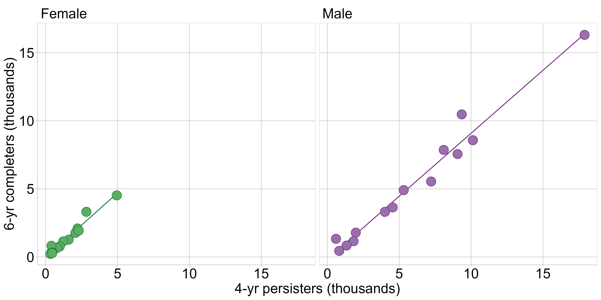

```{marginfigure, echo=TRUE}
*Richard Layton* resides online at 

- <https://www.graphdoctor.com>    
- <https://github.com/graphdr>    
```

```{r setup, include=FALSE}
knitr::opts_chunk$set(echo=FALSE, warning=FALSE, message=FALSE)
knitr::opts_knit$set(root.dir = "../")

library(data.table)
library(ggplot2)
library(knitr)
library(graphclassmate)
library(magick)
library(docxtools)

library(tufte)
library(tufterhandout)
# invalidate cache when the tufte version changes
knitr::opts_chunk$set(cache.extra = packageVersion('tufte'))
options(htmltools.dir.version = FALSE)

options(
  datatable.print.nrows = 16,
  datatable.print.topn = 6,
  datatable.print.class = TRUE
)
```


```{r fig.height = 0.1}
put_gap()
```


# Variables, design, message

```{marginfigure, echo=TRUE}
_Trees, Maps, and Theorems_ by Jean-luc Doumont (2009) inspired the four main topics. 
```

{width="70%"}

```{r fig.height = 2.5}
put_gap()
```


```{r}
# slide index
ii = 3
```


# `r "\U00A7"` Showing evolution

```{marginfigure, echo=TRUE}
Square brackets *[i]*  give the slide number. 
```

## [`r ii = ii + 1; ii`] Time series

{width="140%"}


# `r "\U00A7"` Displaying distributions

## [`r ii = ii + 2; ii`] Data 

World speed skiing (km/hr) competitions  1953--1995

```{r}
#| comment: NULL
#| echo: false

options(
  datatable.print.nrows = 10,
  datatable.print.topn = 6
)

library("GDAdata")
x <- data.table(SpeedSki)
x <- x[, .(Year, Speed, Sex, Event)]
setcolorder(x, c("Year", "Event", "Sex"))
setkeyv(x, c("Year", "Event", "Sex"))
x[]
```

## [`r ii = ii + 1; ii`] Strip chart

{width="140%"}

## [`r ii = ii + 1; ii`] Add a category

{width="140%"}

## [`r ii = ii + 1; ii`] Add a second category

{width="140%"}

## [`r ii = ii + 1; ii`] Data

MIDFIELD graduates (N = 270k), enrolled in Engineering, excluding 10th and 90th quantiles

```{r}
#| comment: NULL

options(
  datatable.print.nrows = 10,
  datatable.print.topn = 5
)

dt <- readRDS("data/boxplot-merge-category.rds")
dt[, sex := ifelse(sex_path %ilike% "female", "Female", "Male")]
dt <- dt[, .(path, sex, enrolled)]
setnames(dt, old = c("enrolled"), new = c("years_to_grad"))
setkeyv(dt, c("path", "sex"))
dt[]
```

## [`r ii = ii + 1; ii`] Box and whisker chart

{width="140%"}

## [`r ii = ii + 1; ii`] Add a category

{width="140%"}

## [`r ii = ii + 1; ii`] Combine a second category

{width="140%"}


## [`r ii = ii + 1; ii`] Data

Revisiting the USD electrical data

```{r}
#| comment: NULL

options(
  datatable.print.nrows = 10,
  datatable.print.topn = 5
)

dt <- readRDS("data/usd-elec-data.rds")

dt <- dt[, .(bill_year, bill_month, date_peak, minutes, source, MW)]
setkeyv(dt, c("date_peak", "minutes"))
dt[]
```

## [`r ii = ii + 1; ii`] Ignoring time

{width="140%"}


## [`r ii = ii + 1; ii`] Discussion: Displaying distributions

Quantitative test scores from a recent exam could be displayed as a distribution. What categorical variable(s) could be added to create comparative distributions?


```{marginfigure, echo=TRUE}

``` 


```{r fig.height=2}
put_gap()
```


# `r "\U00A7"` Comparing data

## [`r ii = ii + 2; ii`] Data


Representation at graduation in 3 engineering programs, 19 US institutions, 1987--2018

```{r}
#| comment: NULL
dt <- fread("data/session-2-compare-repr-at-grad.csv")
dt[]
```

## [`r ii = ii + 1; ii`] Dot chart

{width="140%"}

## [`r ii = ii + 1; ii`] Add a second category

{width="140%"}

## [`r ii = ii + 1; ii`] Exchange mapping of categorical variables

{width="140%"}


## [`r ii = ii + 1; ii`] Logarithmic scale for orders of magnitude differences

{width="140%"}

## [`r ii = ii + 1; ii`] One program per facet

{width="140%"}

## [`r ii = ii + 1; ii`] Add a third category 

{width="140%"}

## [`r ii = ii + 1; ii`] Combine categories

{width="140%"}

## [`r ii = ii + 1; ii`] Discussion: Comparing data

Consider Table 2 Campus Buildings in the USD Energy Master Plan (p. 17-18). If we were to visualize these data in dot-chart form:

- Select the quantitative variable

```{marginfigure, echo=TRUE}

``` 

```{r fig.height=0.8}
put_gap()
```

- Select a categorical variable for the rows

```{r fig.height=0.8}
put_gap()
```

- How would you order the rows? 

```{r fig.height=0.8}
put_gap()
```

- Select a second categorical variable for the facets


# `r "\U00A7"` Revealing correlations

## [`r ii = ii + 2; ii`] Data

Engineering students at 14 institutions persisting to year 4 and graduating by year 6, 1987-2019

```{r}
#| comment: NULL
options(
  datatable.print.nrows = 6,
  datatable.print.topn = 3
)
dt <- fread("data/four-year-six-year.csv")
dt[]
```

## [`r ii = ii + 1; ii`] Scatterplots are designed to reveal correlation

{width="51%"}

## [`r ii = ii + 1; ii`] Add a category

{width="51%"}


## [`r ii = ii + 1; ii`] One facet per sex

{width="120%"}

```{r fig.height=1}
put_gap()
```

## [`r ii = ii + 1; ii`] One facet per institution

{width="150%"}

```{r fig.height=1}
put_gap()
```


## [`r ii = ii + 1; ii`] Change the quantitative variable

Engineering students at 14 institutions persisting to year 4 and graduating by year 6, 1987--2019

```{r fig.height=0.2}
put_gap()
```

{width="130%"}

```{r fig.height=0.5}
put_gap()
```

## [`r ii = ii + 1; ii`] Discussion: Revealing correlations

Figure 17 (p. 36) of the USD Energy Master Plan has the form of a scatterplot. We must assume that the authors are attempting to discover a correlation between two quantitative variables. 

```{marginfigure, echo=TRUE}

```

- What are the two quantitative variables?

```{r fig.height=0.7}
put_gap()
```

- Do the variables appear to be correlated?  

```{r fig.height=0.7}
put_gap()
```

- Is the linear curve fit justified? 


# `r "\U00A7"` Closing discussion 

```{marginfigure, echo=TRUE}

``` 

## [`r ii = ii + 2; ii`] Variables, design, message 

- Chart design depends on your variables


- Chart design depends on the message the data convey


- Continue to expand your repertoire of chart types


```{r fig.height=4}
put_gap()
```


# References
